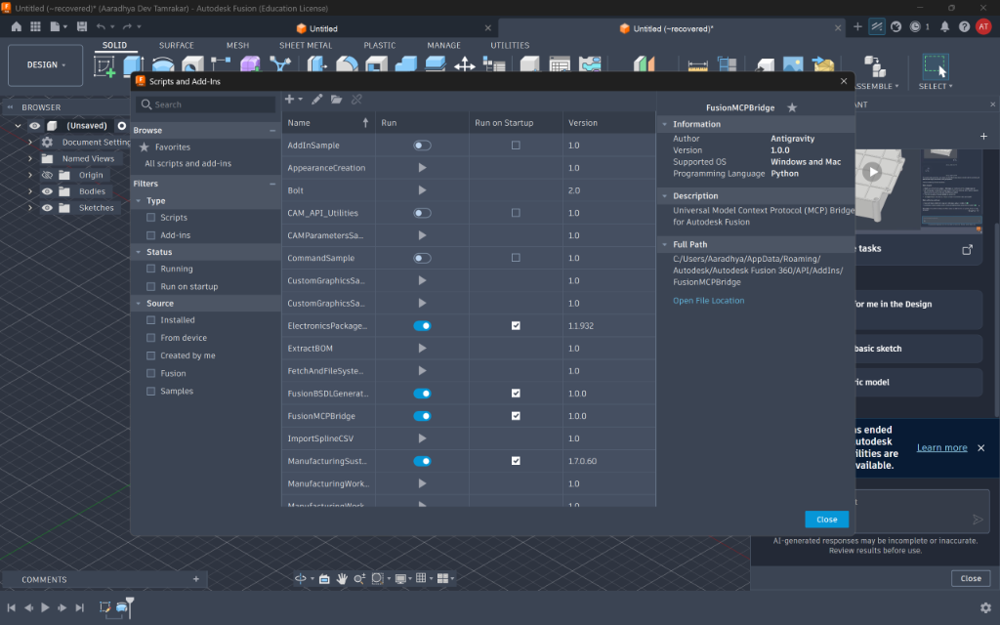
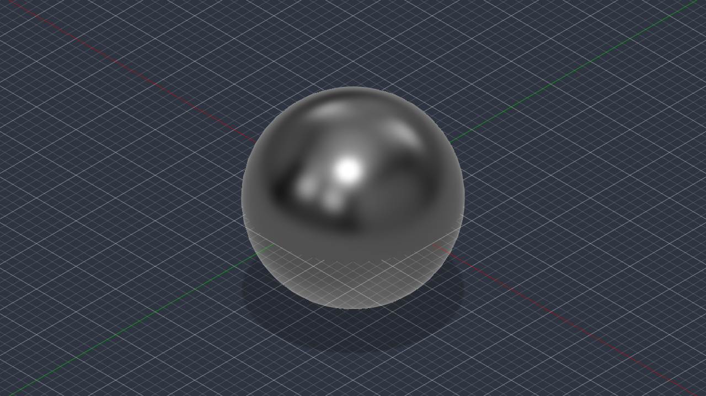
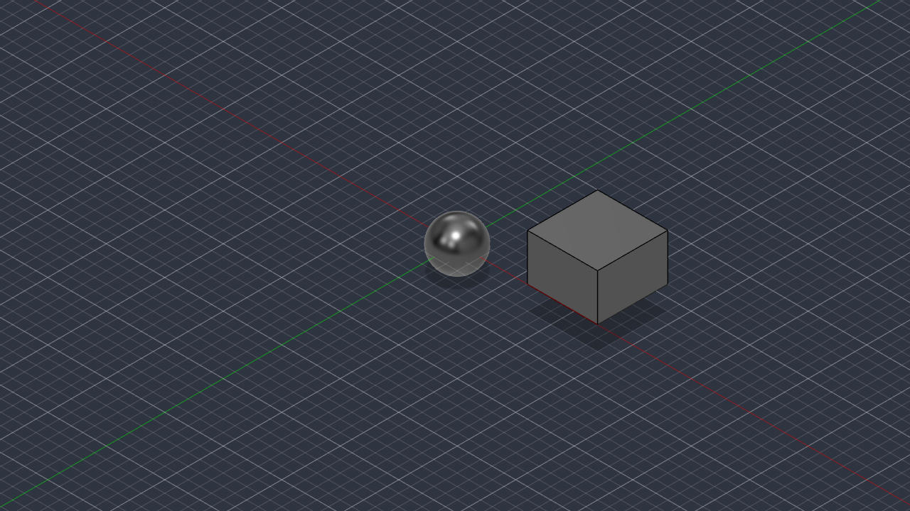

# Fusion 360 MCP Bridge

A lightweight, zero-dependency **Model Context Protocol (MCP)** server built as a native Python Add-In for **Autodesk Fusion 360**. 

It bridges AI coding assistants (**Google Antigravity**, **Claude Desktop**, **Cursor**, etc.) directly with Autodesk Fusion, enabling real-time programmatic CAD modeling, geometric inspection, script execution, and viewport rendering.

---

## Why This Exists

* **Universal Compatibility**: Works across **any** version of Fusion 360 (native, legacy, offline, educational, or custom builds) that supports Python Add-Ins.
* **No Cloud / Licensing Lock**: Does not depend on Autodesk's proprietary C++ MCP endpoints or cloud connectivity flags.
* **Thread-Safe by Design**: Fusion's API requires calls to run on the main UI thread. This Add-In executes an embedded HTTP server in a background thread and uses Fusion's native `CustomEvent` subsystem to dispatch commands safely to the main thread without freezing or crashing the application (`INV-FUS-001`).
* **Zero External Dependencies**: Implemented purely with Python standard libraries (`http.server`, `socketserver`, `threading`, `json`, `queue`, `base64`, `tempfile`) bundled inside Fusion's embedded Python runtime. No `pip install` required (`INV-FUS-002`).

---

## Architecture & Communication Flow

```
+-------------------------------------------------------------------------+
| AI Agent / MCP Client (Antigravity, Claude Desktop, Cursor)             |
| Configuration: http://127.0.0.1:9876/mcp                                |
+-----------------------------------+-------------------------------------+
                                    | JSON-RPC 2.0 (HTTP POST)
                                    v
+-------------------------------------------------------------------------+
| Autodesk Fusion 360 Process                                             |
|                                                                         |
|  [ Background Worker Thread ]                                           |
|    - Listens on 127.0.0.1:9876                                          |
|    - Handles /health (GET) and /mcp (POST)                              |
|    - Fires app.fireCustomEvent() & awaits threading.Event completion    |
|                               |                                         |
|                               v                                         |
|  [ Main UI Thread (Single-Threaded CAD Operations) ]                    |
|    - CustomEventHandler processes request                               |
|    - Executes CAD geometry modifications (adsk.core, adsk.fusion)       |
|    - Captures stdout, error traces, or viewport screenshots             |
|    - Signals background worker and returns JSON response                |
+-------------------------------------------------------------------------+
```

---

## Quick Installation

### Option 1: Automated Script (PowerShell)
From the repository root, run:
```powershell
.\install.ps1
```
This automatically copies `FusionMCPBridge.py` and `FusionMCPBridge.manifest` to your Fusion 360 Add-Ins directory:
`%APPDATA%\Autodesk\Autodesk Fusion 360\API\AddIns\FusionMCPBridge\`

### Option 2: Manual Copy
Copy the `FusionMCPBridge/` folder directly into:
```text
%APPDATA%\Autodesk\Autodesk Fusion 360\API\AddIns\
```

---

## How to Run & Start the Bridge

1. Launch **Autodesk Fusion 360**.
2. Press **`Shift + S`** (or go to **Utilities** &rarr; **Add-Ins** &rarr; **Scripts and Add-Ins** in the top ribbon).
3. Switch to the **Add-Ins** tab.
4. Locate **`FusionMCPBridge`** in the list.
5. Click the **toggle switch** so it turns **blue (ON)**.
6. *(Recommended)* Check **"Run on Startup"** so the bridge starts automatically whenever Fusion 360 opens.
7. **Important**: Click **"Close"** on the dialog. *(Autodesk Fusion pauses message pumping while modal dialogs are open; closing the dialog allows the main CAD canvas to dispatch and execute agent commands immediately).*



The bridge will begin listening immediately on `http://127.0.0.1:9876/mcp`.

---

## End-to-End Live Verification & Visual Proof

The bridge has been empirically verified against live Autodesk Fusion 360 sessions (`EMPIRICALLY_VERIFIED`).

### Step 1: Initial Canvas Inspection (`get_model_info` + `capture_screenshot`)
The agent queries document hierarchy, detects `Body1` (Sphere, \(4.1888\text{ cm}^3\)), and captures the active 3D graphics canvas in real time:



### Step 2: Live Parametric Actuation (`create_primitive`)
The agent dispatches a command to construct a parametric solid box (\(3 \times 3 \times 2\text{ cm}\)), generating `Extrude1` &rarr; `Body2` (\(18.0\text{ cm}^3\)), and re-captures the canvas:



---

## Verification & Testing Commands

You can verify the bridge directly from your terminal using PowerShell or `curl`:

### 1. Health Probe
```powershell
Invoke-RestMethod -Uri "http://127.0.0.1:9876/health" -Method Get | ConvertTo-Json
```
**Expected Response:**
```json
{
  "server": "FusionMCPBridge",
  "status": "ok",
  "port": 9876,
  "version": "1.0.0"
}
```

### 2. Discover Registered Tools
```powershell
$body = @{
    jsonrpc = "2.0"
    id = 1
    method = "tools/list"
    params = @{}
} | ConvertTo-Json

Invoke-RestMethod -Uri "http://127.0.0.1:9876/mcp" -Method Post -Body $body -ContentType "application/json" | ConvertTo-Json -Depth 5
```

### 3. Query Active Model Hierarchy
```powershell
$body = @{
    jsonrpc = "2.0"
    id = 2
    method = "tools/call"
    params = @{
        name = "get_model_info"
        arguments = @{}
    }
} | ConvertTo-Json -Depth 5

Invoke-RestMethod -Uri "http://127.0.0.1:9876/mcp" -Method Post -Body $body -ContentType "application/json"
```

### 4. Create a Parametric Box Primitive
```powershell
$body = @{
    jsonrpc = "2.0"
    id = 3
    method = "tools/call"
    params = @{
        name = "create_primitive"
        arguments = @{
            shape = "box"
            length = 3.0
            width = 3.0
            height = 2.0
            x = 3.0
            y = 0.0
            z = 0.0
        }
    }
} | ConvertTo-Json -Depth 5

Invoke-RestMethod -Uri "http://127.0.0.1:9876/mcp" -Method Post -Body $body -ContentType "application/json"
```

### 5. Capture Live Viewport Image
```powershell
$body = @{
    jsonrpc = "2.0"
    id = 4
    method = "tools/call"
    params = @{
        name = "capture_screenshot"
        arguments = @{
            width = 1280
            height = 720
        }
    }
} | ConvertTo-Json -Depth 5

$resp = Invoke-RestMethod -Uri "http://127.0.0.1:9876/mcp" -Method Post -Body $body -ContentType "application/json"
$parsed = $resp.result.content[0].text | ConvertFrom-Json
$imgBytes = [System.Convert]::FromBase64String($parsed.base64)
[System.IO.File]::WriteAllBytes("fusion_screenshot.png", $imgBytes)
```

---

## Client Configuration

### 1. Google Antigravity
Add to `~/.gemini/config/mcp_config.json`:
```json
{
  "mcpServers": {
    "fusion360_bridge": {
      "serverUrl": "http://127.0.0.1:9876/mcp"
    }
  }
}
```

### 2. Cursor
Add under **Settings &rarr; Features &rarr; MCP Servers** or in `~/.cursor/mcp.json`:
```json
{
  "mcpServers": {
    "fusion360_bridge": {
      "url": "http://127.0.0.1:9876/mcp"
    }
  }
}
```

### 3. Claude Desktop
Add to `%APPDATA%\Claude\claude_desktop_config.json`:
```json
{
  "mcpServers": {
    "fusion360_bridge": {
      "url": "http://127.0.0.1:9876/mcp"
    }
  }
}
```

---

## Exposed Tools Reference

| Tool | Description | Parameters |
| :--- | :--- | :--- |
| `execute_script` | Runs dynamic Python scripts inside the live Fusion session with full `adsk` API access. Output and errors are captured and returned. | `script` (string, required) |
| `create_primitive` | Creates parametric 3D bodies (`sphere`, `box`, `cylinder`) at specified $(x, y, z)$ coordinates. | `shape` (`sphere` \| `box` \| `cylinder`), `radius`, `length`, `width`, `height`, `x`, `y`, `z` |
| `get_model_info` | Retrieves comprehensive model hierarchy: open document, bodies, volume, sketches, profiles, and user parameters. | *(None)* |
| `capture_screenshot` | Renders a PNG snapshot of the active graphics viewport and returns base64-encoded image data. | `width` (default 800), `height` (default 600) |
| `undo_redo` | Reverts or reapplies transactions in the active design timeline. | `action` (`undo` \| `redo`) |

---

## Repository Structure

```
fusion360-mcp/
├── docs/
│   └── screenshots/
│       ├── fusion_addins_dialog.png          # Add-In activation in Fusion UI
│       ├── fusion_live_viewport_before.png   # Viewport inspection capture
│       └── fusion_live_viewport_after.png    # Viewport post-actuation capture
├── FusionMCPBridge/
│   ├── FusionMCPBridge.manifest              # Autodesk Add-In definition
│   ├── FusionMCPBridge.py                    # HTTP JSON-RPC MCP server & dispatcher
│   └── install.ps1                           # Subfolder install helper
├── install.ps1                               # One-click installation script
├── .gitignore
├── LICENSE
└── README.md
```

---

## Invariants & Guarantees

* **`INV-FUS-001` (Main-Thread Single-Ownership)**: All CAD API operations are dispatched to Fusion's main thread via `adsk.core.CustomEvent`. Background worker threads never access the CAD model directly.
* **`INV-FUS-002` (Zero External Dependencies)**: Built entirely on Python 3.10 standard library modules available in Fusion 360.
* **`INV-FUS-003` (Graceful Teardown & Port Recycling)**: Cleanly unregisters events and closes sockets upon stopping or application termination.

---

## License

MIT License. See [LICENSE](LICENSE) for details.